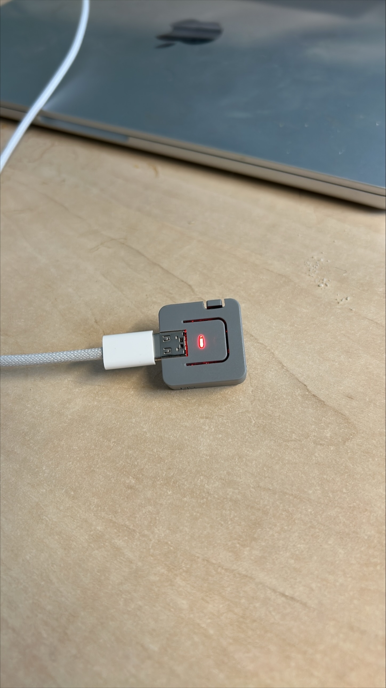
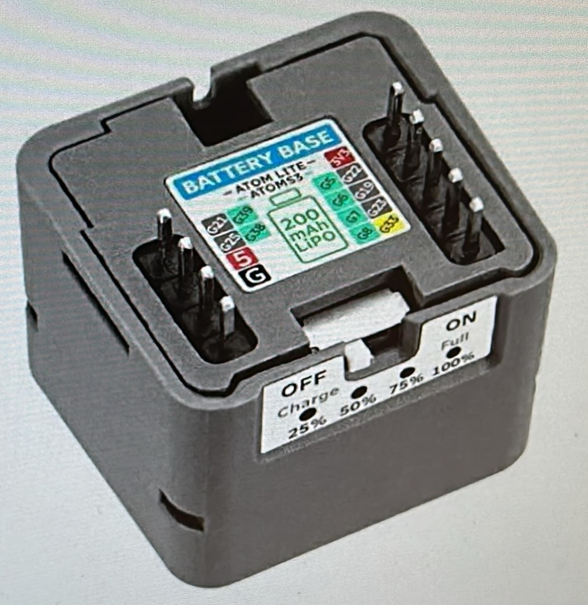
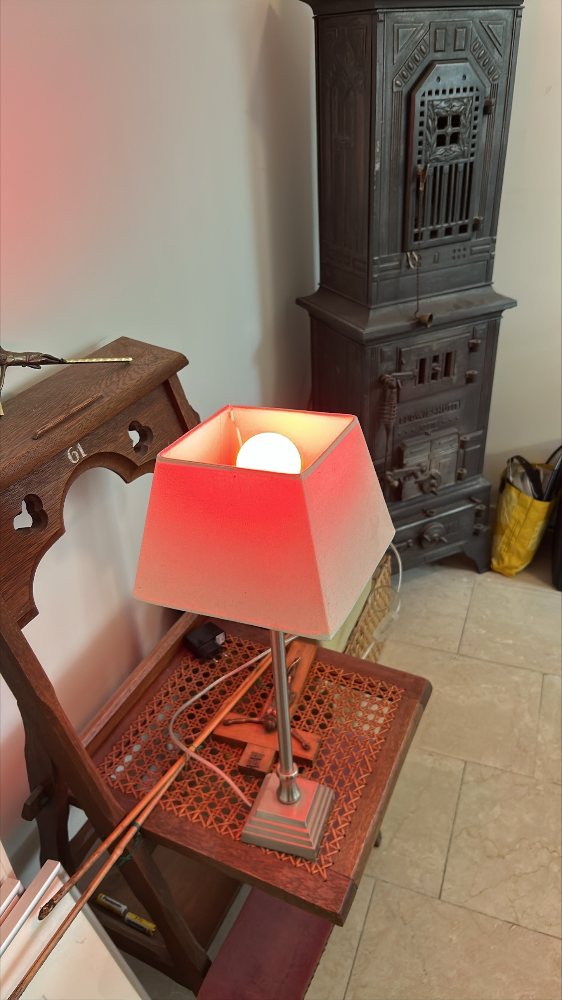
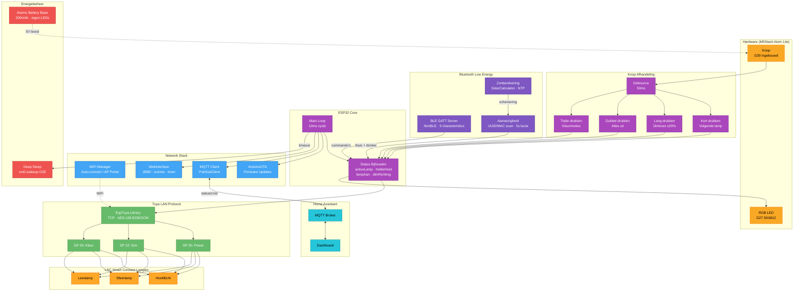
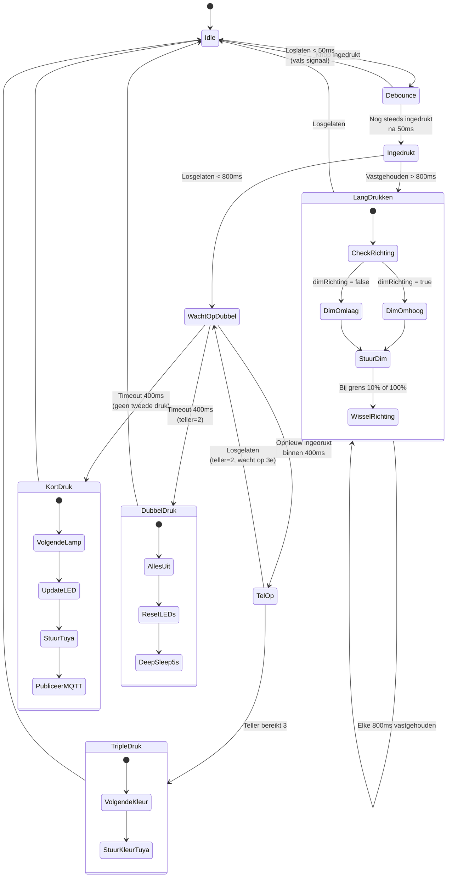
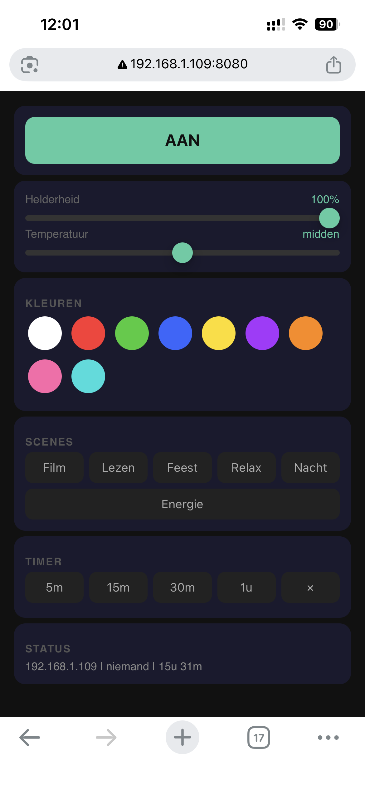

# Woonkamer Lamp Controller

Een draadloze knop om Action (LSC Smart Connect) lampen in de woonkamer te bedienen. Geen cloud, geen app, gewoon een knopje op tafel en klaar.

**Auteur:** Koen Verhallen



> *M5Stack Atom Lite + Atomic Battery Base — de rode LED geeft aan dat het Hoofdlicht actief is. USB-C kabel alleen nodig voor opladen.*

## Waarom dit project?

Ik heb een MBO opleiding Mechatronica gedaan en werk inmiddels een paar jaar in de techniek. Ik was op zoek naar een hobbyproject waarin ik de theorie uit mijn opleiding kon toepassen in iets praktisch. Iets wat ik zelf daadwerkelijk zou gebruiken.

Het begon eigenlijk met een irritatie: elke avond drie verschillende lampen aan- en uitzetten via de Action-app op mijn telefoon. Telefoon zoeken, app openen, wachten tot hij verbindt, per lamp schakelen. Voor iets simpels als licht aan en uit voelde dat omslachtig.

Toen dacht ik: dat moet toch simpeler kunnen? Gewoon een knopje, zoals vroeger, maar dan slim. Eén knop waarmee je door de lampen heen bladert, kunt dimmen, van kleur verandert en alles in één keer uit zet. En het moest draadloos op tafel kunnen liggen — geen kabel, geen gedoe.

Na een eerste prototype op een ESP32 DevKit (v1 en v2, met breadboard, losse LEDs en een 18650 batterij) bleek dat te groot en te rommellig. Toen ontdekte ik de **M5Stack Atom Lite**: een ESP32 van 24×24mm met ingebouwde knop en RGB LED. Met de **Atomic Battery Base** eronder heb je een compleet draadloos apparaatje dat op de salontafel ligt en weken meegaat op één lading.

Maar alleen een fysieke knop was niet genoeg. Lotte wilde ook de lampen kunnen bedienen zonder de codes te hoeven onthouden. Dus heb ik er een **webinterface** op gebouwd — een responsive pagina met een dark theme die je gewoon opent op je telefoon. Knoppen voor aan/uit, sliders voor helderheid en kleurtemperatuur, snelkleuren, scenes zoals "Film" of "Relax", en een timer. Die draait volledig op de ESP32 zelf, geen externe server nodig. En via **Bluetooth** kun je de lampen bedienen met Siri Shortcuts of een BLE app. De controller herkent zelfs automatisch wanneer we thuiskomen (via onze AirPods en telefoon) en zet de lampen aan als het donker is.

Het project combineert veel van wat ik bij Mechatronica heb geleerd: embedded C++ op een microcontroller, draadloze protocollen (WiFi, BLE GATT, Tuya LAN), netwerkcommunicatie (MQTT, HTTP), responsive web development, en het hele traject van idee naar werkend product.

Het is bewust een low-budget project. De Atom Lite kost een tientje, de batterij base ook, en de lampen komen van de Action. Het hele project is voor minder dan **€30** te bouwen. Geen dure hub, geen maandelijks abonnement, geen cloud, gewoon lokaal WiFi.

Ik deel het hier zodat anderen het kunnen nabouwen, ervan kunnen leren, of het als basis kunnen gebruiken voor hun eigen projecten.

*— Koen*

## Features

- **Eén-knop bediening** — kort/lang/dubbel/triple drukken voor verschillende functies
- **BLE telefoonbediening** — bedien je lampen via Bluetooth (nRF Connect, LightBlue, of Siri Shortcuts)
- **Aanwezigheidsdetectie** — lampen automatisch aan als je thuiskomt (en het donker is)
- **Zonsondergang automatisering** — berekent schemering, lampen gaan aan bij donker
- **Webinterface** — bedieningspagina met knoppen, sliders, kleuren, scenes en timer
- **Deep sleep** — slaapt na 60 seconden inactiviteit, batterij gaat weken mee
- **WiFi Manager** — WiFi configureren via je telefoon, geen code aanpassen
- **OTA updates** — firmware draadloos updaten via WiFi
- **MQTT / Home Assistant** — lampstatus publiceren, lampen aansturen vanuit je dashboard
- **RGB LED feedback** — kleur toont welke lamp actief is, knippert bij fouten
- **Modulair** — elke feature kan aan/uit gezet worden via `#define` in config.h

## Wat doet het?

Met de ingebouwde knop op de Atom Lite bedien je tot 3 slimme lampen:

| Actie | Functie |
|-------|---------|
| **Kort drukken** | Wissel naar de volgende lamp (of alles uit) |
| **Lang drukken** (>800ms) | Dim de actieve lamp met 20% |
| **Dubbel drukken** (<400ms) | Alles uit → deep sleep na 5s |
| **Triple drukken** | Volgende kleurmodus (wit → warm → koud → rood → groen → blauw → paars → oranje) |

De lampen worden direct via het lokale WiFi-netwerk aangestuurd met het Tuya LAN protocol (v3.3 + v3.5). Geen internet of cloud nodig.

Na 60 seconden inactiviteit gaat de controller in **deep sleep**. Druk op de knop om hem wakker te maken — hij is binnen 2 seconden weer online.

## Hardware

### Benodigdheden

| Onderdeel | Specificatie | Prijs |
|-----------|-------------|-------|
| M5Stack Atom Lite | ESP32-PICO-D4, ingebouwde knop + RGB LED | ~€9 |
| Atomic Battery Base | 200mAh LiPo, click-on, boost naar 5V | ~€9 |
| Action LSC lampen (3x) | Smart Connect, E27, WiFi/Tuya | ~€13 |
| USB-C kabel | Voor opladen | ~€0 |
| **Totaal** | | **~€31** |

Geen breadboard, geen losse draden, geen behuizing nodig. De Atom Lite klikt op de Battery Base en dat is het.

### Componenten

| | | |
|:---:|:---:|:---:|
|  |  |  |
| Atom Lite in actie — rode LED = Hoofdlicht actief | Atomic Battery Base (200mAh) | Action LSC lamp op kleur in de woonkamer |

### Battery Base

De Atomic Battery Base klikt direct onder de Atom Lite (zelfde 24×24mm formaat):

- **200mAh LiPo** batterij met ETA9085E boost converter → stabiele 5V
- **Fysieke schakelaar**: ON = gebruiken, OFF = opladen via USB-C
- **4 LED indicatoren**: tonen batterijniveau (25% / 50% / 75% / 100%)
- **Oplaad indicatie**: blauw LED = bezig, groen LED = vol

### Hardware diagram

```
┌─────────────────────────────────────┐
│         M5Stack Atom Lite           │
│  ┌─────────┐  ┌──────────────────┐  │
│  │  Knop   │  │   RGB LED        │  │
│  │  (G39)  │  │   (G27, SK6812)  │  │
│  └─────────┘  └──────────────────┘  │
│         ESP32-PICO-D4               │
│         WiFi + BLE                  │
│         4MB Flash, 520KB SRAM       │
├─────────────────────────────────────┤
│      Atomic Battery Base            │
│  ┌──────────┐  ┌────────────────┐   │
│  │ 200mAh   │  │ ON/OFF switch  │   │
│  │ LiPo     │  │ 4x battery LED │   │
│  └──────────┘  └────────────────┘   │
│      USB-C (opladen)                │
└─────────────────────────────────────┘
         │ WiFi (Tuya LAN protocol)
         ▼
  ┌──────────────┐  ┌──────────────┐  ┌──────────────┐
  │  Hoofdlicht  │  │  Sfeerlamp   │  │  Leeslamp    │
  │  LSC E27     │  │  LSC E27     │  │  LSC E27     │
  └──────────────┘  └──────────────┘  └──────────────┘
```

## Architectuur

De firmware is opgebouwd in logische lagen. Onderaan zit de **hardware laag**: de ingebouwde knop op G39 (met debouncing) en de SK6812 RGB LED op G27 die per kleur laat zien welke lamp actief is. De **netwerk laag** combineert WiFi (via WiFi Manager), het Tuya LAN protocol (TCP/AES) voor directe lampbesturing, BLE GATT voor telefoonbediening, en MQTT voor Home Assistant. De **applicatie laag** brengt alles samen: knoplogica, BLE aanwezigheidsdetectie (herkent Koen's AirPods en Lotte's telefoon), zonberekening voor automatische schemering-detectie, en een webinterface met scenes en timer. De **power laag** beheert deep sleep na inactiviteit, met ext0 wakeup via de knop.

Qua bestanden is het simpel gehouden: `config.h` bevat alle instelbare waarden, `secrets.h` bevat je persoonlijke credentials (staat in `.gitignore`), `EspTuya.h` is de Tuya protocol library, `webpagina.h` de embedded webinterface, en `ESP32_Tuya_Knop.ino` de daadwerkelijke logica.

### Software Diagram



### Dataflow

```
Knop → Debounce → Kort/Lang/Dubbel/Triple → Status Update → EspTuya → Lamp (LAN)
                                                  |
                                        RGB LED + MQTT + BLE notify
```

| Laag | Componenten | Taak |
|------|-------------|------|
| **Input** | Knop (G39), BLE GATT, Webinterface, MQTT | Gebruikersinput via 4 kanalen |
| **Logica** | Main loop + state machine | Lamp selectie, dimmen, kleuren, scenes, alles uit |
| **Protocol** | EspTuya (TCP/AES-ECB + AES-GCM) | Tuya v3.3 + v3.5 LAN commando's |
| **Output** | RGB LED + 3x Lamp | Visuele feedback + lamp aansturing |
| **Netwerk** | WiFi Manager, OTA, MQTT, BLE | Configuratie, updates, Home Assistant, telefoon |
| **Automatisering** | Aanwezigheid + zonberekening | Lampen aan bij thuiskomst in het donker |
| **Power** | Deep sleep + ext0 wakeup | Batterij besparing, weken standby |

### Knop State Machine

De drukknop wordt afgehandeld als een state machine met drie timers: debounce (50ms), lang-druk detectie (800ms) en dubbel-druk venster (400ms).



| State | Conditie | Actie |
|-------|----------|-------|
| **Idle** | Wacht op knop | Check deep sleep timeout |
| **Debounce** | 50ms wachten | Filter contactdender |
| **Ingedrukt** | Knop vast | Timer loopt voor lang-druk detectie |
| **WachtOpDubbel** | Net losgelaten | 400ms venster voor tweede/derde druk |
| **KortDruk** | Timeout dubbel | `activeLamp++`, vorige uit, nieuwe aan |
| **LangDrukken** | > 800ms vast | Helderheid ±20%, wissel richting bij grens |
| **DubbelDruk** | 2x binnen 400ms | Alle lampen uit, deep sleep na 5 seconden |
| **TripleDruk** | 3x binnen 400ms | Volgende kleurmodus (8 modi cyclus) |

## BLE Bediening

De controller draait een BLE GATT server (NimBLE) met 5 characteristics:

| Characteristic | UUID | Type | Functie |
|---------------|------|------|---------|
| Lamp selectie | `...7891` | uint8 write | 0=uit, 1-3=lamp selecteren |
| Helderheid | `...7892` | uint8 write | 0-100% |
| Power | `...7893` | uint8 write | 0=uit, 1=aan |
| Commando | `...7894` | string write | Tekstcommando's (aan, uit, dim 50, rood, etc.) |
| Status | `...7895` | string read/notify | JSON status uitlezen |

### Aanwezigheidsdetectie

De controller scant elke 30 seconden (5 seconden burst) voor bekende BLE apparaten:

- **Apple apparaten** (AirPods): matching op service UUID (omdat iPhones hun MAC roteren)
- **Android apparaten**: matching op MAC-adres

Als iemand thuiskomt **en** het is donker (berekend via zonberekening), gaan de lampen automatisch aan. Als iedereen weg is, gaan ze uit. Een handmatige "uit" actie blokkeert de automatisering voor 30 minuten.

## Webinterface

De controller draait een ingebouwde webserver met een **responsive, mobile-first webinterface** — ontworpen om op je telefoon te gebruiken als je op de bank zit. De hele pagina (HTML, CSS, JavaScript) is embedded in de firmware als PROGMEM en wordt in chunks verstuurd voor betrouwbare overdracht op de ESP32.



Beschikbaar op `http://<ip>:8080/` met:

- Aan/uit knop per lamp
- Helderheid slider (touch-friendly, werkt op mobiel)
- Kleurtemperatuur slider (warm ↔ koud)
- 9 snelkleuren (wit, rood, groen, blauw, geel, paars, oranje, roze, cyaan)
- 6 scenes (Film, Lezen, Feest, Relax, Nacht, Energie)
- Timer (5, 15, 30, 60 minuten)
- Live status weergave (WiFi, aanwezigheid, uptime, countdown)

De interface communiceert via een **REST API** met JSON responses — dezelfde endpoints zijn ook direct te gebruiken via Siri Shortcuts of curl:
```
GET /api/aan          → lamp aan
GET /api/uit          → lamp uit
GET /api/dim/50       → dim 50%
GET /api/kleur/rood   → rood
GET /api/scene/film   → film scene
GET /api/timer/30     → uit over 30 min
```

## MQTT & Home Assistant

De controller publiceert zijn status via MQTT en kan ook commando's ontvangen.

### Topics

| Topic | Richting | Beschrijving |
|-------|----------|-------------|
| `.../status` | Controller → HA | JSON met lampstatus en helderheid |
| `.../cmd` | HA → Controller | Commando's (lamp1_on, dim_50, alles_uit) |
| `.../aanwezigheid` | Controller → HA | JSON: wie is thuis |
| `.../donker` | Controller → HA | Bool: is het donker buiten |
| `.../online` | Controller → HA | LWT: "online" of "offline" (bij deep sleep) |

### Status payload

```json
{
  "actief": 0,
  "helderheid": 100,
  "lampen": [
    {"naam": "Hoofdlicht", "aan": true},
    {"naam": "Sfeerlamp", "aan": false},
    {"naam": "Leeslamp", "aan": false}
  ]
}
```

## Software installeren

Zie [`HANDLEIDING.md`](HANDLEIDING.md) voor de complete stap-voor-stap handleiding. Kort samengevat:

1. Lampen toevoegen via Smart Life app
2. Local keys ophalen via tinytuya
3. Arduino IDE + ESP32 board + libraries installeren
4. `secrets.example.h` kopiëren naar `secrets.h` en invullen
5. Flashen naar M5Stack Atom Lite
6. WiFi configureren via telefoon

### Libraries

- **FastLED** — RGB LED aansturing
- **NimBLE-Arduino** (h2zero) — BLE GATT server + presence scanning
- **SolarCalculator** — zonsopkomst/-ondergang berekening
- **WiFiManager** (tzapu) — WiFi configuratie via captive portal
- **PubSubClient** — MQTT client
- **ArduinoJson** — JSON parsing

## Mappenstructuur

```
esp32-tuya-knop/
├── ESP32_Tuya_Knop/             Arduino IDE sketch folder (open dit in Arduino IDE)
│   ├── ESP32_Tuya_Knop.ino      Hoofdprogramma (logica, ~1500 regels)
│   ├── config.h                 Instellingen (features, pinnen, timings, BLE, MQTT)
│   ├── secrets.example.h        Template voor credentials
│   ├── secrets.h                Jouw credentials (NIET in git)
│   ├── EspTuya.h                Tuya LAN protocol library (v3.3 + v3.5, AES-ECB/GCM)
│   └── webpagina.h              Embedded responsive webinterface (HTML/CSS/JS)
├── hardware/
│   └── schema_elektronisch.svg  Systeem schema (Atom Lite + Battery Base + WiFi/BLE)
├── images/componenten/          Foto's van de hardware
├── HANDLEIDING.md               Stap-voor-stap setup handleiding (16 stappen)
├── CHANGELOG.md                 Versiegeschiedenis (v1.0 → v3.1)
├── ROADMAP.md                   Toekomstige features
└── LICENSE                      MIT licentie
```

## Lampen

Dit project werkt met de **LSC Smart Connect** lampen van Action:

| Variant | Watt | Lumen | Fitting | Prijs |
|---------|------|-------|---------|-------|
| Multicolor 3-pack | 8W | 700 lm | E27 | €12,95 |
| Multicolor los | 9W | 806 lm | E27 | €6,95 |
| Filament | 5.5W | 470 lm | E27 | €6,95 |

Alle lampen werken via 2.4 GHz WiFi met het Tuya protocol. Ze zijn alleen verkrijgbaar in de fysieke Action winkel.

## Wat ik heb geleerd

Dit project is in meerdere iteraties gebouwd, en elke versie leerde me weer iets nieuws.

**v1 → v2 (ESP32 DevKit):** Ik begon met alles in één `.ino` bestand. Dat werd al snel onleesbaar. Het scheiden van configuratie (`config.h`) en credentials (`secrets.h`) was een belangrijke les in code organisatie. Ook leerde ik hoe `delay()` je hele programma blokkeert — voor een knop-controller acceptabel, maar het besef was er.

**v2 → v3 (M5Stack Atom Lite):** De overstap naar de Atom Lite was meer dan een port. Ik moest leren hoe BLE en WiFi naast elkaar draaien op dezelfde ESP32 chip — dat gaat niet vanzelf. NimBLE was de oplossing: veel lichter dan Bluedroid, en met burst-scanning (5 seconden scan, 25 seconden pauze) geef je WiFi genoeg ruimte. De BLE GATT server opzetten met eigen service UUIDs en characteristics was nieuw voor mij. Het Tuya protocol reverse-engineeren met tinytuya en implementeren in een header-only library (AES-ECB voor v3.3, AES-GCM voor v3.5) was het meest technisch uitdagende onderdeel. De webinterface was ook een leuk uitstapje: een complete responsive UI bouwen die in 4KB PROGMEM past, in chunks verstuurd wordt zodat de ESP32 niet out-of-memory gaat, en toch bruikbaar is op je telefoon met sliders, kleurknoppen en een timer.

**v3.1 (Battery Base):** Het toevoegen van deep sleep klinkt simpel, maar je moet alles netjes afsluiten (BLE deinit, MQTT LWT offline publiceren) voordat je gaat slapen. De ext0 wakeup op G39 werkt goed, maar je moet rekening houden met de boot-tijd (~2s) na een deep sleep wake.

**Wat ik er aan overhoud:** WiFi en BLE protocollen, hoe MQTT werkt, hoe je credentials veilig houdt, embedded power management, en het hele traject van idee → prototype → product. En misschien wel het belangrijkste: leren wanneer iets "goed genoeg" is om te shippen.

## Skills gedemonstreerd

- **Embedded C++** — Arduino framework, state machines, ISR-safe queues
- **Bluetooth Low Energy** — GATT server, service/characteristic design, presence scanning, UUID matching
- **WiFi** — station mode, captive portal, mDNS, HTTP server
- **Tuya LAN Protocol** — TCP sockets, AES-128-ECB/GCM encryption, session negotiation, custom library
- **MQTT** — QoS levels, LWT, retained messages, JSON payloads
- **Power Management** — deep sleep, ext0 wakeup, BLE/WiFi coexistence optimization
- **Web Development** — embedded HTTP server, REST API, responsive mobile-first UI (HTML/CSS/JS), PROGMEM chunked transfer
- **Hardware** — M5Stack ecosystem, GPIO mapping, RGB LED (SK6812/NeoPixel)

## Versiebeheer

Dit project gebruikt [Semantic Versioning](https://semver.org/). Huidige versie: **v3.1.0**.

Zie [`CHANGELOG.md`](CHANGELOG.md) voor de volledige versiegeschiedenis.

## Licentie

MIT, zie [LICENSE](LICENSE)

---

*Koen Verhallen, 2026*
