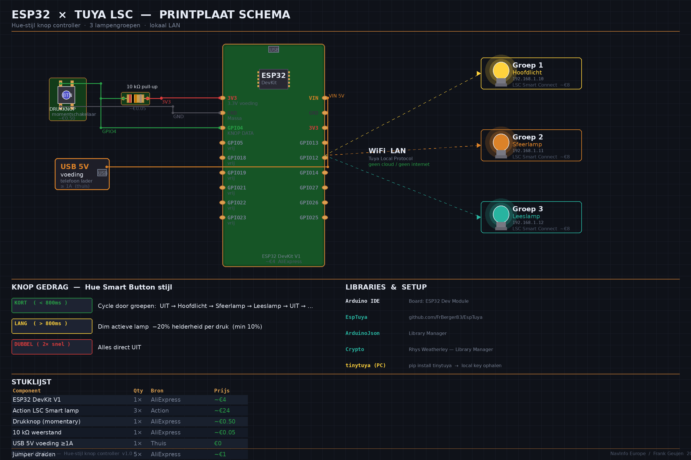
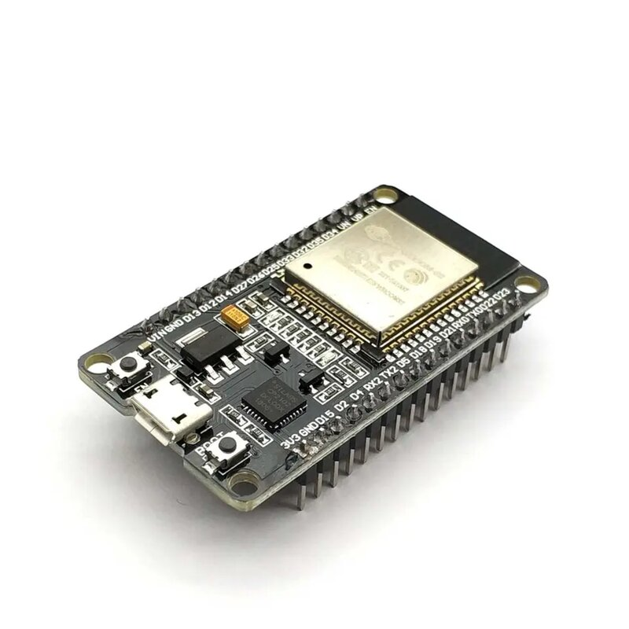
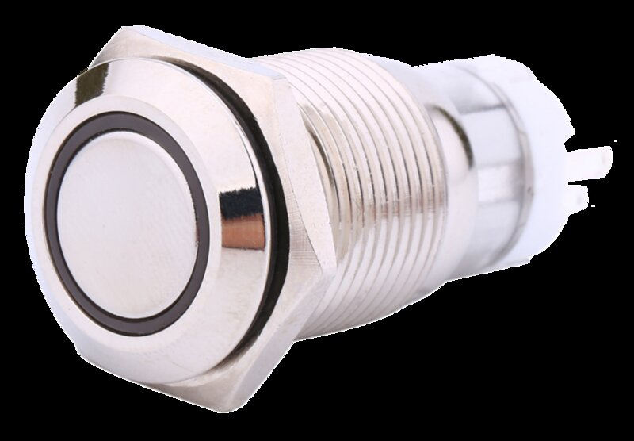
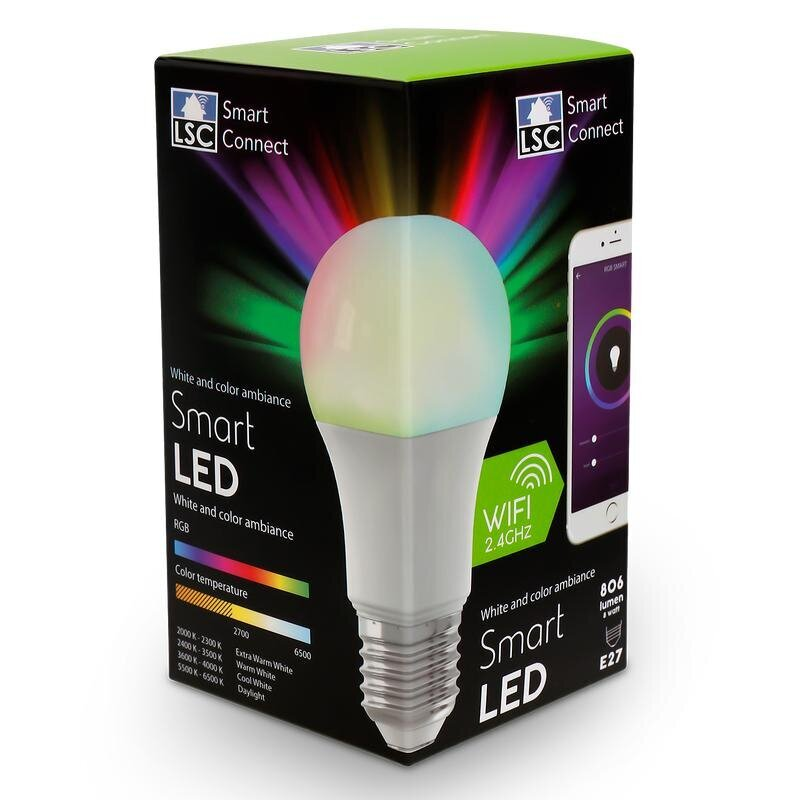
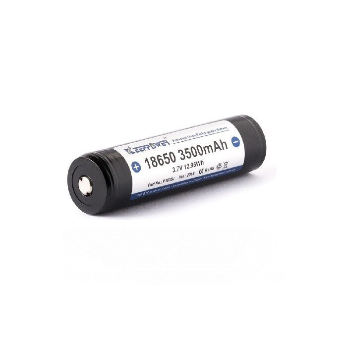
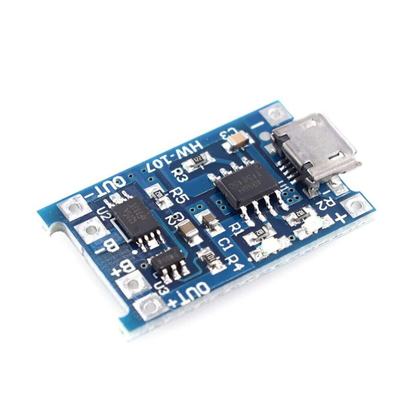
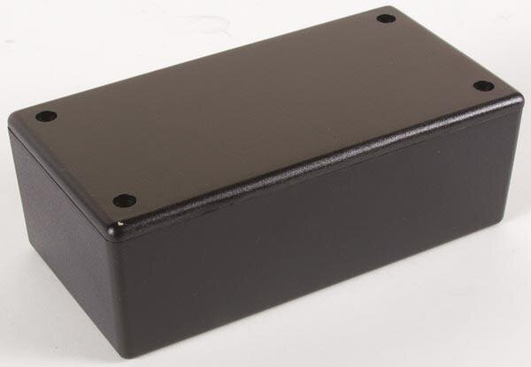
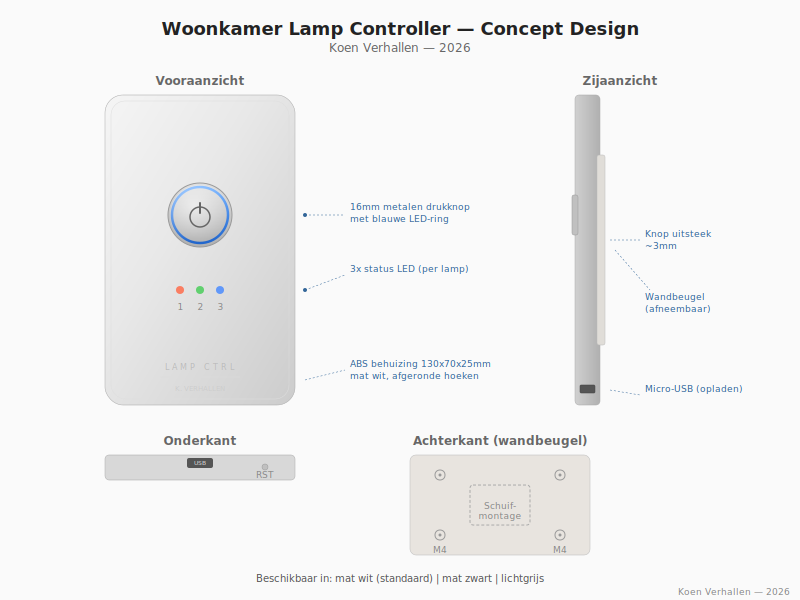

# Woonkamer Lamp Controller

Een ESP32-gebaseerde drukknop controller om Action (LSC Smart Connect) lampen in de woonkamer te bedienen via WiFi. Geen cloud, geen app, gewoon een knopje en klaar.

**Auteur:** Koen Verhallen

<!-- Vervang dit door een foto van het eindresultaat -->


> *Foto's van de build volgen zodra het prototype af is.*

## Waarom dit project?

Ik heb een MBO opleiding Mechatronica gedaan en werk inmiddels een paar jaar in de techniek. Ik was op zoek naar een hobbyproject waarin ik de theorie uit mijn opleiding kon toepassen in iets praktisch. Iets wat ik zelf daadwerkelijk zou gebruiken.

Het begon eigenlijk met een irritatie: elke avond drie verschillende lampen aan- en uitzetten via de Action-app op mijn telefoon. Telefoon zoeken, app openen, wachten tot hij verbindt, per lamp schakelen. Voor iets simpels als licht aan en uit voelde dat omslachtig.

Toen dacht ik: dat moet toch simpeler kunnen? Gewoon een knopje aan de muur, zoals vroeger, maar dan slim. Eén knop waarmee je door de lampen heen bladert, kunt dimmen en alles in één keer uit zet.

Dit project combineert veel van wat ik bij Mechatronica heb geleerd: embedded programmeren op een microcontroller, elektronisch ontwerpen (pull-up weerstanden, debouncing), netwerkprotocollen (WiFi, Tuya LAN), en het hele traject van idee naar werkend product, inclusief behuizing ontwerpen, een stuklijst maken en alles documenteren.

Het is bewust een low-budget project. De ESP32 kost een tientje, de lampen komen van de Action, en de rest zijn standaard componenten. Het hele project is voor minder dan €65 te bouwen. Geen dure hub, geen maandelijks abonnement, geen cloud, gewoon lokaal WiFi.

De volgende stap is om het te koppelen aan Home Assistant, zodat de knop ook samenwerkt met de rest van mijn smarthome setup. Maar dat is voor later. Eerst moet de basis goed werken.

Ik deel het hier zodat anderen het kunnen nabouwen, ervan kunnen leren, of het als basis kunnen gebruiken voor hun eigen projecten.

*- Koen*

## Features

- **Eén-knop bediening** - kort/lang/dubbel drukken voor verschillende functies
- **WiFi Manager** - bij eerste boot WiFi configureren via je telefoon, geen code aanpassen
- **OTA updates** - firmware draadloos updaten via WiFi
- **Deep sleep** - na 60 seconden inactiviteit gaat de ESP32 slapen, batterij gaat maanden mee
- **Batterij monitoring** - LEDs knipperen als de batterij bijna leeg is
- **Foutafhandeling** - LED knippert snel als een lamp niet bereikbaar is
- **MQTT / Home Assistant** - lampstatus publiceren, lampen aansturen vanuit je dashboard
- **Dimmen omhoog en omlaag** - afwisselend bij lang drukken
- **Status LEDs** - 3 LEDs tonen welke lamp aan staat
- **Modulair** - elke feature kan aan/uit gezet worden via `#define` in de code

## Wat doet het?

Met een enkele drukknop op de ESP32 bedien je tot 3 slimme lampen in de woonkamer:

| Actie | Functie |
|-------|---------|
| **Kort drukken** | Wissel naar de volgende lamp (of alles uit) |
| **Lang drukken** (>800ms) | Dim de actieve lamp met 20% |
| **Dubbel drukken** (<400ms) | Alles uit |

De lampen worden direct via het lokale WiFi-netwerk aangestuurd met het Tuya LAN protocol. Geen internet of cloud nodig.

## Architectuur

De code is opgebouwd in een paar logische lagen. Onderaan zit de **hardware laag**, daar wordt de knop uitgelezen (met debouncing), de LEDs aangestuurd en de batterijspanning gemeten via de ADC. Daarboven zit de **netwerk laag**: WiFi Manager regelt de verbinding, het Tuya LAN protocol praat direct met de lampen, en MQTT zorgt voor de koppeling met Home Assistant. De **applicatie laag** brengt alles samen: de knoplogica (kort/lang/dubbel drukken), het dimmen, en een simpele state machine die bijhoudt welke lamp actief is. Tot slot zijn er nog een paar **utility functies**: logging via Serial voor debugging, batterij monitoring die waarschuwt als het bijna op is, en deep sleep om de batterij te sparen.

Qua bestanden is het simpel gehouden: `config.h` bevat alle instelbare waarden (timings, pinnen, drempels), `secrets.h` bevat je persoonlijke credentials zoals lamp IP's, keys en MQTT-gegevens (die staat in `.gitignore` en gaat niet mee in git), en `ESP32_Tuya_Knop.ino` bevat de daadwerkelijke logica.

## Foto's

> *Wordt aangevuld met foto's van het bouwproces en eindresultaat.*

<!--
Uncomment zodra de foto's gemaakt zijn:

### Eindresultaat


### Binnenkant


### Breadboard prototype


### Onderdelen


### Aan de muur

-->

## Hardware

### Benodigdheden

| Onderdeel | Specificatie |
|-----------|-------------|
| ESP32 DevKit V1 | ESP-WROOM-32, dual-core, WiFi + Bluetooth |
| Drukknop | 16mm metaal, momentary, panel mount |
| Weerstand 10kΩ | 1/4W, pull-up voor drukknop |
| Weerstanden 220Ω (3x) | Voorschakeling status LEDs |
| LEDs 5mm (3x) | Status per lamp (rood/groen/blauw) |
| Weerstanden 100kΩ (2x) | Spanningsdeler batterij monitoring |
| Action lampen | LSC Smart Connect, E27, WiFi/Tuya |
| Voeding | Micro-USB of 18650 batterij met TP4056 lader |
| Behuizing | ABS project box ~130x70x45mm |

Zie [`docs/Stuklijst_Woonkamer_Lamp_Controller.xlsx`](docs/Stuklijst_Woonkamer_Lamp_Controller.xlsx) voor de volledige stuklijst met prijzen en links naar Nederlandse webshops.

### Componenten

| | | |
|:---:|:---:|:---:|
|  |  |  |
| ESP32 DevKit V1 | Drukknop 16mm | Action LSC lamp |
|  |  |  |
| 18650 batterij | TP4056 lader | ABS behuizing |

### Bedrading

```
ESP32 GPIO4  ──── Knop pin 1 ──── 10kΩ ──── 3V3     (drukknop + pull-up)
ESP32 GND    ──── Knop pin 2
ESP32 GPIO16 ──── 220Ω ──── LED 1 ──── GND           (status Hoofdlicht)
ESP32 GPIO17 ──── 220Ω ──── LED 2 ──── GND           (status Sfeerlamp)
ESP32 GPIO18 ──── 220Ω ──── LED 3 ──── GND           (status Leeslamp)
ESP32 GPIO35 ──── 100kΩ ──┬── batterij +              (spanningsdeler)
                   GND ──── 100kΩ ──┘
ESP32 VIN    ──── USB 5V of TP4056 output
ESP32 GND    ──── USB GND
```

Zie [`hardware/`](hardware/) voor de elektronische schema's en mechanische tekeningen.

### Concept design

Het ontwerp is gebaseerd op een compact wanddoosje, vergelijkbaar met een Hue dimmer switch:



## Software installeren

### 1. Arduino IDE

Download en installeer de Arduino IDE (v2.x) van [arduino.cc](https://www.arduino.cc/en/software).

### 2. ESP32 board toevoegen

In Arduino IDE: **File > Preferences > Additional Boards Manager URLs**, voeg toe:

```
https://raw.githubusercontent.com/espressif/arduino-esp32/gh-pages/package_esp32_index.json
```

Ga naar **Tools > Board > Boards Manager**, zoek `esp32` en installeer.

### 3. Libraries installeren

Via **Sketch > Include Library > Manage Libraries**:
- ArduinoJson
- Crypto
- WiFiManager (by tzapu)
- PubSubClient (by Nick O'Leary)

Handmatig toevoegen via **Sketch > Include Library > Add .ZIP Library**:
- EspTuya

### 4. Tuya local keys ophalen

Om de lampen lokaal aan te sturen heb je de local keys nodig:

```bash
pip install tinytuya
python -m tinytuya wizard
```

Volg de stappen (gratis iot.tuya.com account nodig). Noteer het IP-adres en de local key van elke lamp.

### 5. Credentials instellen

Kopieer `secrets.example.h` naar `secrets.h` en vul je eigen gegevens in:

- Lamp IP-adressen en local keys
- MQTT broker adres, gebruikersnaam en wachtwoord

`secrets.h` staat in `.gitignore` en wordt niet meegecommit, zo blijven je credentials veilig.

### 6. Testen

Selecteer **Tools > Board > ESP32 Dev Module** en klik Upload. Open de Serial Monitor (115200 baud) en druk op de knop. Je ziet welke lamp wordt geschakeld.

## Mappenstructuur

```
ESP32_Tuya_Knop/
├── ESP32_Tuya_Knop.ino               De Arduino sketch (logica)
├── config.h                          Instellingen (pinnen, timings, drempels)
├── secrets.example.h                 Template voor credentials
├── secrets.h                         Jouw credentials (NIET in git)
├── CHANGELOG.md                      Versiegeschiedenis
├── README.md                         Dit bestand
├── LICENSE                           MIT licentie
├── docs/
│   └── Stuklijst_...xlsx             Stuklijst met prijzen en URLs
├── hardware/
│   ├── schema_elektronisch.svg       Elektronisch schema
│   ├── concept_design.svg            Product concept rendering
│   └── tekening_behuizing.svg        Mechanische tekening met maten
└── images/
    ├── ESP32_Tuya_Schema.png         Schema afbeelding
    ├── componenten/                  Foto's van de gebruikte onderdelen
    └── *.jpg                         Build foto's (volgen)
```

> **Let op:** `secrets.h` staat in `.gitignore` en wordt niet meegecommit. Gebruik `secrets.example.h` als template.

## Lampen

Dit project werkt met de **LSC Smart Connect** lampen van Action:

| Variant | Watt | Lumen | Fitting | Prijs |
|---------|------|-------|---------|-------|
| Multicolor 3-pack | 8W | 700 lm | E27 | €12,95 |
| Multicolor los | 9W | 806 lm | E27 | €6,95 |
| Filament | 5.5W | 470 lm | E27 | €6,95 |

Alle lampen werken via 2.4 GHz WiFi met het Tuya protocol. Ze zijn alleen verkrijgbaar in de fysieke Action winkel.

## MQTT & Home Assistant

De controller publiceert zijn status via MQTT en kan ook commando's ontvangen. Hierdoor werkt hij naadloos samen met [Home Assistant](https://www.home-assistant.io/).

### Topics

| Topic | Richting | Beschrijving |
|-------|----------|-------------|
| `woonkamer/lampcontroller/status` | Controller → HA | JSON met huidige lampstatus en helderheid |
| `woonkamer/lampcontroller/cmd` | HA → Controller | Commando's om lampen te schakelen/dimmen |
| `woonkamer/lampcontroller/batterij` | Controller → HA | Batterijspanning in volt (bijv. `3.85`) |
| `woonkamer/lampcontroller/online` | Controller → HA | LWT topic, `online` of `offline` |

### Status payload

Bij elke wijziging publiceert de controller een JSON bericht op het status topic:

```json
{
  "actief": 0,
  "helderheid": 100,
  "lampen": [
    {"naam": "Hoofdlicht", "aan": true},
    {"naam": "Sfeerlamp", "aan": false},
    {"naam": "Leeslamp", "aan": false}
  ]
}
```

### Commando's

Stuur een van deze commando's naar het `cmd` topic om lampen aan te sturen vanuit Home Assistant:

| Commando | Wat het doet |
|----------|-------------|
| `lamp1_on` | Hoofdlicht aan |
| `lamp1_off` | Hoofdlicht uit |
| `lamp2_dim_50` | Sfeerlamp dimmen naar 50% |
| `alles_uit` | Alle lampen uit |

### Last Will & Testament

De controller stuurt bij verbinding een LWT bericht naar het `online` topic. Als de controller offline gaat (batterij leeg, WiFi weg, deep sleep) ziet Home Assistant dat meteen, het topic springt automatisch naar `offline`. Handig voor automatiseringen die rekening houden met of de knop bereikbaar is.

### Waarom MQTT erbij?

De knop stuurt de lampen sowieso rechtstreeks aan via het Tuya LAN protocol, dat werkt altijd, ook als Home Assistant of het netwerk er even uit ligt. Maar met MQTT erbij kun je de lampstatus terugzien op je dashboard, automatiseringen bouwen (bijv. lampen uit als je van huis gaat), de knop combineren met andere slimme apparaten, en het batterijniveau monitoren vanuit Home Assistant.

De LSC Smart Connect lampen van Action zijn sowieso al te integreren in Home Assistant via de [Tuya-integratie](https://www.home-assistant.io/integrations/tuya/) of [LocalTuya](https://github.com/rospogriern/localtuya). De meerwaarde van deze knop is dat hij ook werkt als Home Assistant of het netwerk er even uit ligt, alles gaat direct via het lokale Tuya LAN protocol.

## OTA updates

Je hoeft de ESP32 niet elke keer via USB aan te sluiten om nieuwe firmware te uploaden. Zolang hij aan staat en op hetzelfde WiFi-netwerk zit, kun je draadloos updaten.

**Via Arduino IDE:**
Ga naar **Tools > Port** en kies de netwerkpoort `lamp-controller`. Upload je sketch zoals je normaal zou doen.

**Via PlatformIO:**
```bash
pio run --target upload --upload-port lamp-controller.local
```

> **Let op:** De ESP32 moet op hetzelfde WiFi-netwerk zitten als je computer. Als de netwerkpoort niet verschijnt, controleer dan of de ESP32 wakker is (niet in deep sleep) en of mDNS niet geblokkeerd wordt door je router.

## Toekomstige plannen

- [x] WiFi Manager (configuratie via telefoon bij eerste boot)
- [x] Deep sleep modus (batterij besparing)
- [x] Batterij niveau monitoring via LED
- [x] Foutafhandeling als lamp niet bereikbaar is
- [x] OTA firmware updates via WiFi
- [x] Home Assistant / MQTT integratie
- [x] Helderheid omhoog en omlaag (afwisselend)
- [x] Status LEDs per lamp
- [ ] Scenes (bijv. "filmavond", "lezen", "alles vol")
- [ ] Web interface voor lamp configuratie
- [ ] Meerdere knoppen / remote ondersteuning

## Wat ik heb geleerd

Toen ik begon had ik alles in één groot `.ino` bestand staan: configuratie, credentials, logica, alles door elkaar. Dat werkte, maar het werd al snel onoverzichtelijk. Uiteindelijk heb ik de config en credentials naar aparte bestanden verplaatst. Als ik het opnieuw zou doen, zou ik dat meteen zo opzetten. Maar goed, je leert het pas als je er tegenaan loopt.

Op een paar plekken gebruik ik nog `delay()` voor LED feedback, wat even de hele loop blokkeert. Voor een knop-controller maakt dat niet zoveel uit (je drukt toch maar één keer), maar in een groter project zou ik dat met `millis()` non-blocking doen. Hetzelfde geldt voor de Tuya-verbinding: die wordt nu per commando opnieuw opgezet. Dat werkt prima, maar het is niet supersnel. Een persistent connection zou beter zijn, alleen moet je dan ook reconnect-logica bouwen als de verbinding wegvalt. Dat soort afwegingen vind ik eigenlijk het interessantste aan dit project.

Qua testen heb ik vooral de Serial Monitor gebruikt: knop drukken, kijken of de juiste lamp schakelt, output nalezen. Een testframework zou netter zijn, maar voor embedded is dat een stuk lastiger dan bij "gewone" software. Dat is zeker iets waar ik me nog in wil verdiepen.

Wat ik er uiteindelijk van heb geleerd gaat verder dan alleen code schrijven: WiFi protocollen, hoe MQTT werkt, hoe je credentials veilig houdt buiten je repository, en hoe je embedded software opzet zodat het ook over een paar maanden nog te begrijpen is. En misschien wel het belangrijkste: het hele traject van een idee naar iets dat daadwerkelijk aan de muur hangt en werkt. De volgende stap is het toevoegen van scenes en een web interface, en misschien een keer een fatsoenlijk testframework uitproberen.

## Versiebeheer

Dit project gebruikt [Semantic Versioning](https://semver.org/). Huidige versie: **v2.1.0**.

Zie [`CHANGELOG.md`](CHANGELOG.md) voor de volledige versiegeschiedenis.

## Licentie

MIT, zie [LICENSE](LICENSE)

---

*Koen Verhallen, 2026*
